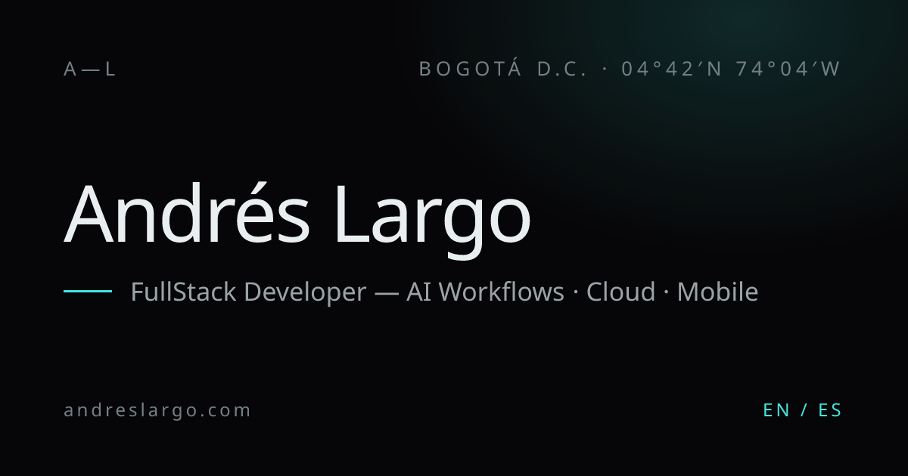

# Andrés Largo — Portfolio

Source code for **[andreslargo.com](https://www.andreslargo.com)**, the personal site of Andrés Largo, Senior Full-Stack Engineer based in Bogotá. It is a dark, cinematic one-page portfolio built around a real-time 3D "living system" graph in the hero (nodes, edges and data flows that react to the mouse and to scroll), followed by scroll-driven sections for About, Experience, Selected Work, a Skills constellation and Contact. The site is bilingual (English / Spanish) and ships as a fully static export hosted on AWS Amplify.

**Live:** https://www.andreslargo.com




## Highlights

- **Real-time 3D hero** — a procedurally generated system graph (6 clusters, 132 nodes on desktop / 84 on mobile, plus animated data flows) rendered with React Three Fiber and custom GLSL shaders with additive blending. The camera reacts to mouse parallax and scroll progress.
- **Single animation loop** — one `requestAnimationFrame` loop owned by the Lenis provider drives smooth scrolling, motion lerps and the R3F frame (`frameloop="never"`), so the scene never stalls when `gsap.ticker` sleeps. GSAP ScrollTrigger handles scroll-scrubbed hero timelines.
- **Progressive enhancement** — the 3D scene is code-split and loaded client-side only; it is skipped entirely when WebGL is unavailable or `prefers-reduced-motion` is set, falling back to a CSS gradient + grain + vignette "poster". Reveal animations use IntersectionObserver with a safety timeout, so content is never left invisible.
- **Skills constellation** — an interactive SVG visualization on wide screens, with an accessible list as the SSR / no-JS / mobile / reduced-motion default.
- **Internationalization** — English (default) and Spanish via `next-intl`, statically generated per locale (`/en/`, `/es/`) without middleware.
- **SEO built in** — localized metadata, canonical + `hreflang` alternates, Open Graph / Twitter cards, a generated OG image and Apple icon (`next/og`), JSON-LD (`Person` + `WebSite`), `sitemap.xml` and `robots.txt`.
- **Accessibility** — skip link, semantic landmarks, keyboard-friendly navigation and reduced-motion support across CSS, Lenis and the 3D layer.
- **Backend-free contact form** — composes a pre-filled `mailto:` link, so the site stays 100% static.
- **Tested** — Vitest + Testing Library cover the graph generator, motion state, skills layout, mailto builder, i18n key parity, design tokens and component rendering.

## Tech stack

| Area | Tools |
| --- | --- |
| Framework | Next.js 15 (App Router, `output: "export"`), React 19, TypeScript |
| 3D | three.js, @react-three/fiber, custom GLSL shaders |
| Motion | GSAP + ScrollTrigger (`@gsap/react`), Lenis smooth scroll |
| Styling | Tailwind CSS 4 (CSS-first `@theme` tokens), custom CSS for grain/vignette |
| i18n | next-intl (EN / ES) |
| Fonts | Clash Display (self-hosted), Instrument Serif and JetBrains Mono via `next/font` |
| Testing | Vitest, Testing Library, jsdom |
| Hosting | AWS Amplify (static hosting) |

## Project structure

```
.
├── amplify.yml              # Amplify build spec (Node 20, npm ci, artifacts from out/)
├── customHttp.yml           # Content-Type headers for the extensionless OG / Apple icon routes
├── messages/                # en.json, es.json translation dictionaries
├── docs/                    # SPEC.md, DEPLOY.md, PERFORMANCE.md (Spanish)
├── design_handoff_andres_portfolio/  # Original HTML prototype + design handoff used as reference
├── tasks/plan.md            # Implementation plan
└── src/
    ├── app/
    │   ├── [locale]/        # layout.tsx (metadata, JSON-LD, providers) and page.tsx
    │   ├── opengraph-image.tsx, apple-icon.tsx, icon.svg
    │   ├── sitemap.ts, robots.ts
    │   └── globals.css      # design tokens, keyframes, reduced-motion rules
    ├── components/          # Hero, SystemGraph, About, Experience, SelectedWork, Skills, Contact, Nav, ...
    ├── providers/           # LenisProvider: the single rAF loop
    ├── hooks/               # useReveal
    ├── i18n/                # locales and next-intl request config
    ├── lib/                 # graph generator, shaders, motion state, content, SEO, mailto
    └── fonts/               # Clash Display woff2 + next/font setup
```

## Getting started

Requires **Node.js >= 20.19.0**.

```bash
git clone https://github.com/teamzz111/Portfolio.git
cd Portfolio
npm ci
npm run dev        # http://localhost:3000 -> /en/ or /es/
```

| Script | Description |
| --- | --- |
| `npm run dev` | Start the Next.js dev server |
| `npm run build` | Build the static export into `out/` |
| `npm run start` | Run `next start` |
| `npm test` | Run the Vitest suite once |
| `npm run test:watch` | Run Vitest in watch mode |

The static export has no page at `/`; locally, open `/en/` or `/es/`. In production the root is redirected by Amplify rewrite rules.

### Environment

No environment variables are required. Optionally, set `NEXT_PUBLIC_SITE_URL` (no trailing slash) at build time to change the absolute origin used for canonical URLs, `hreflang`, Open Graph, the sitemap and `robots.txt` (defaults to `https://andreslargo.com`).

## Deployment

The site is deployed on **AWS Amplify** as static hosting:

1. Amplify picks up `amplify.yml`, runs `npm ci` and `npm run build` on Node 20, and publishes the `out/` directory.
2. Rewrite rules redirect `/` to `/en/`, normalize `/en` and `/es` to their trailing-slash versions and serve `404.html` for unknown paths.
3. `customHttp.yml` forces `Content-Type: image/png` for `/opengraph-image` and `/apple-icon`.

See [`docs/DEPLOY.md`](docs/DEPLOY.md) for the full step-by-step setup (build image, rewrite rules JSON, domain and post-deploy checks).

## Contact

Andrés Largo — [contacto@andreslargo.com](mailto:contacto@andreslargo.com) · [GitHub @teamzz111](https://github.com/teamzz111)
